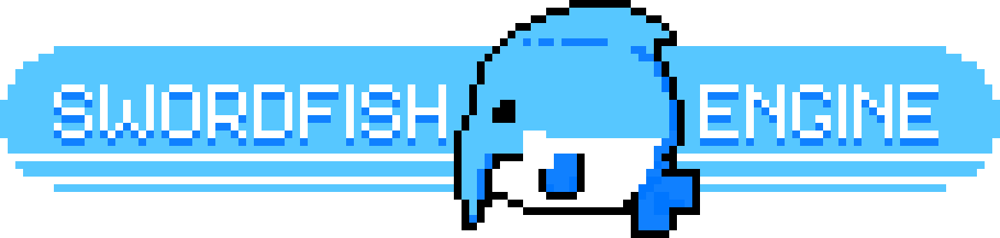

  

# Using
Needlefish (My binary serializer & format) https://github.com/ChaseHuegel/needlefish

Currents / CRNT (My UDP protocol) https://github.com/ChaseHuegel/Currents

Silk.NET (OpenGL and ImGui wrappers) https://github.com/dotnet/Silk.NET

ImageSharp (Image loading) https://github.com/SixLabors/ImageSharp

glTF2Loader (GLTF parsing) https://github.com/KhronosGroup/glTF-CSharp-Loader

DryIoc (DI) https://github.com/dadhi/DryIoc

Tomlet (TOML files) https://github.com/SamboyCoding/Tomlet

JoltPhysicsSharp ([Jolt Physics](https://github.com/jrouwe/JoltPhysics) C# bindings) https://github.com/amerkoleci/JoltPhysicsSharp/tree/main

# Swordfish 3: Current State
Swordfish is on V3 and underwent a full rewrite from V2 to better support modularity and extensibility, as well as decouple from tight dependencies on specific frameworks and APIs. This new version is an ongoing effort and the progress is tracked here.

### Core
- [x] Upgrade to NET 8.0
- [x] Multithreaded focus
- [x] Dependency injection focus
- [x] Localization support
- [x] Strong file parsing and import support
- [x] Command/CLI APIs
- [x] Entity Component System (ECS)
- [x] Physics
  - [x] 3D
  - [ ] 2D
- [x] UI
    - [x] 2D
    - [ ] 3D
    - [ ] File support
    - [ ] Visual editor
- [x] Renderer
  - [ ] Particles
  - [x] Lighting
    - [ ] Shadows
    - [x] Ambient
    - [x] Directional
    - [ ] Point
    - [ ] Spot
  - [x] 3D
    - [x] OpenGL
    - [ ] Vulkan
  - [ ] 2D
    - [ ] OpenGL
    - [ ] Vulkan
  - [x] Shaders
    - [x] Shader lang
      - [x] Parser
      - [ ] Lexer
      - [ ] Linter
      - [ ] Compiler
    - [ ] Built-in PBR
    - [x] Built-in diffuse
    - [x] OpenGL support
    - [ ] Vulkan support

### Networking
- [x] Serialization via Needlefish format
  - [x] Compressed binary format
  - [x] Schema definition lang
  - [x] Code generator
- [ ] UDP support via Currents (CRNT) protocol
- [ ] RUDP support via Currents (CRNT) protocol
- [ ] TCP support
- [ ] ECS integration

### Modding/Plugin Support
- [x] DLL modules
- [x] Module manifests & configuration
- [x] Virtual File System
- [ ] Scripting
  - [x] Parser
  - [x] Lexer
  - [x] Linter
  - [ ] Compiler

### Editor
- [ ] Project generation
- [ ] Project management
- [ ] Visual scripting
- [x] File Browser
- [x] Hierarchy
- [ ] Gizmos
- [ ] VFX editor
- [x] Inspector
  - [x] Read
  - [ ] Write

### Diagnostics
- [x] Profiler
  - [x] Data collection & logging
  - [ ] Viewer
- [x] Logging
  - [x] Log files
  - [x] Developer console
    - [ ] Command support